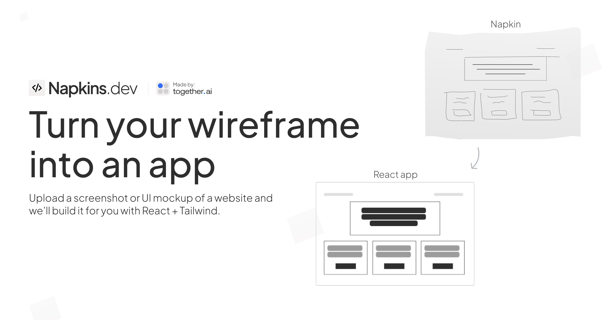

<a href="https://www.napkins.dev">
  
  <h1 align="center">Napkins.dev</h1>
</a>

<p align="center">
  An open source wireframe to app generator. Powered by Llama 3.2 Vision & Together.ai.
</p>

## Tech stack

- [Llama 3.1 405B](https://ai.meta.com/blog/meta-llama-3-1/) from Meta for the LLM
- [Llama 3.2 Vision](https://ai.meta.com/blog/meta-llama-3-1/) from Meta for the Vision model
- [Together AI](https://dub.sh/llama3.2vision/?utm_source=example-app&utm_medium=napkins&utm_campaign=napkins-app-signup) for LLM inference
- [Sandpack](https://sandpack.codesandbox.io/) for the code sandbox
- [S3](https://aws.amazon.com/s3/) for image storage
- Next.js app router with Tailwind
- Helicone for observability
- Plausible for website analytics
- [Terraform](https://www.terraform.io/) for infrastructure as code

## Cloning & running

1. Clone the repo: `git clone https://github.com/Nutlope/napkins`
2. Create a `.env` file and add your [Together AI API key](https://dub.sh/llama3.2vision/?utm_source=example-app&utm_medium=napkins&utm_campaign=napkins-app-signup): `TOGETHER_API_KEY=`
3. Set up S3 infrastructure using Terraform (see Infrastructure Setup section below)
4. Run `npm install` and `npm run dev` to install dependencies and run locally

## Infrastructure Setup

### Prerequisites

- [AWS CLI](https://aws.amazon.com/cli/) installed and configured
- [Terraform](https://www.terraform.io/downloads.html) installed

### Setting up S3 with Terraform

1. Navigate to the Terraform directory:
   ```bash
   cd Terraform
   ```

2. Initialize Terraform:
   ```bash
   terraform init
   ```

3. Review the planned changes:
   ```bash
   terraform plan
   ```

4. Apply the infrastructure:
   ```bash
   terraform apply
   ```

5. After successful application, you'll receive the following outputs:
   - `S3_UPLOAD_BUCKET`: The name of your S3 bucket (e.g., "napkins-bucket")
   - `S3_UPLOAD_KEY`: AWS access key for S3 operations
   - `S3_UPLOAD_REGION`: AWS region (default: "us-east-1")
   - `S3_UPLOAD_SECRET`: AWS secret key (sensitive)
   - `bucket_arn`: ARN of the created S3 bucket
   - `iam_user_arn`: ARN of the created IAM user

6. After applying, you'll see output similar to this:
   ```bash
   Apply complete! Resources: 0 added, 0 changed, 0 destroyed.

   Outputs:

   S3_UPLOAD_BUCKET = "napkins-bucket"
   S3_UPLOAD_KEY = "XXXXX"
   S3_UPLOAD_REGION = "us-east-1"
   S3_UPLOAD_SECRET = <sensitive>
   bucket_arn = "arn:aws:s3:::napkins-bucket"
   iam_user_arn = "arn:aws:iam::1111111111:user/next-s3-upload-user"
   ```

7. To get the sensitive S3_UPLOAD_SECRET value, run:
   ```bash
   terraform output -json S3_UPLOAD_SECRET
   "XXXXXXXXXXXXXXXXXXXXXXXXXXXXXXXXXXXXXXXXXXXX"
   ```

8. Add the outputs to your `.env` file:
   ```bash
   S3_UPLOAD_KEY="XXXXX"
   S3_UPLOAD_SECRET="XXXXXXXXXXXXXXXXXXXXXXXXXXXXXXXXXXXXXXXXXXXX"
   S3_UPLOAD_BUCKET="napkins-bucket"
   S3_UPLOAD_REGION="us-east-1"
   ```

### Infrastructure Details

The Terraform configuration creates:
- An S3 bucket for image storage
- An IAM user with limited permissions to access the bucket
- Necessary IAM policies for secure access
- CORS configuration for the bucket
- Encryption and versioning settings

To destroy the infrastructure if needed:
```bash
terraform destroy
```

## Future Tasks

- [ ] Make sure it looks nicer and less cluttered on mobile
- [ ] On the sidebar, show the output from the vision model
- [ ] Experiment with making it better through few shot prompts
- [ ] Add a shadcn toggle to allow folks to use or not use it
- [ ] Allow folks to edit the generated app with a prompt
- [ ] Allow folks to choose from different themes
- [ ] Show versions as the user edits the app
